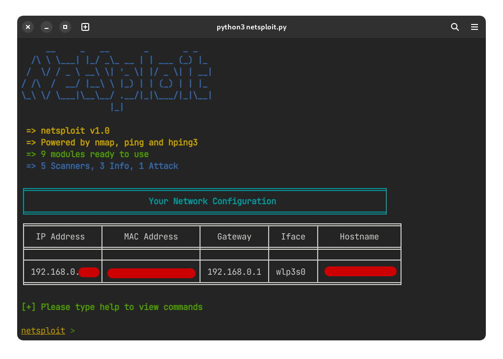

# netsploit-py
### This is a project to help you use nmap and similar network tools easily and efficiently.



Available commands / modules:

| No. | Command | Description |
| --- | --- | --- |
| 1 | network-scanner | Find devices connected to the network |
| 2 | device-info | Get info about a device |
| 3 | oui-lookup | Find the manufacturer of target with OUI |
| 4 | os-guesser | Guess the OS running on target device |
| 5 | port-scanner | Scan the target device for open ports |
| 6 | dos | Run a Denial-Of-Service attack on the target |
| 7 | ping | Ping the target to see if they are online |
| 8 | vuln-scanner | Scan the target for vulnerabilities |

#### NOTE:
- This is a work-in-progress project. Surely many things can be improved here and there, so feel free to open an issue about it.
- If something doesn't work on your platform, please feel free to open an issue about it.
- This project is made targeted for Linux platform. So there it might not work on other platforms. It might work on macOS with some changes.

Install required `pip` packages:

```
pip install simple-colors

pip install pickleDB

pip install tabulate
```

### How to get started:

1. Make sure you have the required packages installed.
- You need `nmap` and `hping3` installed on your system.

2. Clone the repository (recommended):
```sh
$ git clone https://github.com/ArcticDev78/netsploit-py.git
```
OR you can Download the ZIP by clicking on Code > Download ZIP

3. (Required for setup) Create folders for logging:
- First make sure that you are in the git repository folder of netsploit
```sh
$ mkdir logs/
$ cd logs/
$ mkdir device-info network-scanner os-guesser oui-lookup port-scanner vuln-scanner
```

4. Running netsploit
- You can directly run the python file:
```sh
$ python3 netsploit.py
```
- OR you can run the bash script which in turn runs the above command to run the python file (idk why I have this, I'll probably remove it)
```sh
$ ./run.sh
```