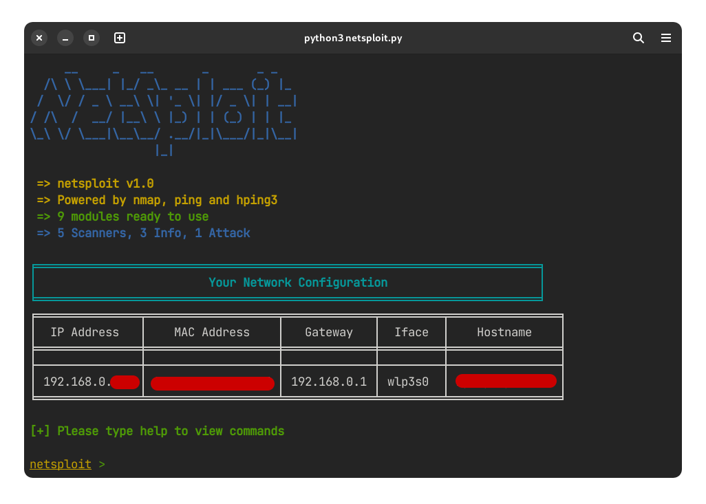

# 📡 Netsploit

###### (Also known as `netsploit-py`)

> #### This is a tool to help you use nmap and similar network tools easily and efficiently.



## 🤔 How does it work?

-   `netsploit-py`, or Netsploit is a CLI wrapper for popular network security/pentesting tools including `nmap`, `hping3` and `ping`.
-   Each feature is in the form of a "module", within which you can configure and run the desired function you want to perform.
-   After running the command in each module, you can choose whether to save a log of the output or not.
    -   Logging will not work out-of-the-box; you WILL need to set it up with the instructions below.
-   As a user, you just need to run the `netsploit.py` file (instructions are given below), you don't need to touch any of the source code unless you want to.

> [!NOTE]
>
> -   This is a work-in-progress project. Surely many things can be improved here and there, so feel free to open an issue about it.
> -   If something doesn't work on your platform, please feel free to open an issue about it.
> -   This project is made targeted for Linux platform. So there it might not work on other platforms. It might work on macOS with some changes.

## 📋 Modules:

> ###### These are the "modules" you can use within Netsploit

| No. | Command         | Description                                  |
| --- | --------------- | -------------------------------------------- |
| 1   | network-scanner | Find devices connected to the network        |
| 2   | device-info     | Get info about a device                      |
| 3   | oui-lookup      | Find the manufacturer of target with OUI     |
| 4   | os-guesser      | Guess the OS running on target device        |
| 5   | port-scanner    | Scan the target device for open ports        |
| 6   | dos             | Run a Denial-Of-Service attack on the target |
| 7   | ping            | Ping the target to see if they are online    |
| 8   | vuln-scanner    | Scan the target for vulnerabilities          |

## ✅ Getting Started

### 🧰 Requirements:

1. Install required `pip` packages:

```bash
$ pip install -r requirements.txt
```

2. Make sure you have the required packages installed on your system

    1. [Python](https://www.python.org/)
    2. [`nmap`](https://nmap.org/)
    3. [`hping3`](https://github.com/antirez/hping)

    - (Refer to the respective links for installation instructions)

### 📦 Installation:

1. Clone the repository (recommended):

```bash
$ git clone https://github.com/ArcticDev78/netsploit-py.git
```

-   OR, you can Download the repository `.zip` file by clicking on `Code > Download ZIP` on this page. Note that using this method means you **cannot** update Netsploit since the last time you last downloaded it.

2. (Required for setup) Setup folders for logging function:

-   First make sure that you are in the git repository folder of `netsploit-py`

```bash
$ mkdir logs/ # Create logs folder
$ cd logs/ # Enter logs folder
$ mkdir device-info network-scanner os-guesser oui-lookup port-scanner vuln-scanner # Create respective log folders for each module
```

## 🖥️ Usage:

1. Run Netsploit:

```bash
$ python3 netsploit.py
```

2. Use either a module or the `auto` command:
    - Use a module of your choice:
        - Type `"use <module>"` to use a module (<module> is the name of the module to use)
    - Use the `auto` command to automate the usage of `netsploit`:
        - Type `auto` in the prompt and follow the prompts to complete your desired action(s).

---

## Sources/Credits:

-   The `oui.txt` file (OUI Lookup Database) was taken from [here](https://www.wireshark.org/download/automated/data/manuf) (the Wireshark website) - I did not create this, nor do I own this.
